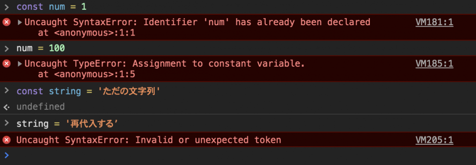

# js workshop sapporo vol1

1. JavaScriptについて
2. 基本的な書き方について
3. 変数について
4. データ型について

## 1.JavaScriptについて

ブラウザで使われてる言語です。最近ではサーバサイドのNode.jsが存在します。

## 2.基本的な書き方について

### 記述場所

1. `<head>` 要素の配下
2. `<body>` 要素の配下（任意の位置）
3. `<body>` 要素の配下（`</body>`閉じタグの直前）

基本的にスクリプトの配置場所は、3が推奨されています。<br>
3でまかなえないケースのみ1を使用します。<br>
関数定義の `<script>` 要素を先に記述しなければならないというルールがあるためです。<br>
`<body>`要素の配下で呼び出す必要がある関数は、`<head>`要素の配下で事前に読み込んでおく必要があります。<br>
Google Analyticsなどのコードは `<head>` 配下に埋め込むことが一般的です。<br>
また、スクリプトからスタイルシートを出力するような状況でも1を仕様することがあります。<br>
1は外部ウィジェットのコードを埋め込む状況以外は使用することはほとんどありません。

課題では3で進めるようにしていきます。

### 課題1

作業用のファイルを作ってみましょう。
index.htmlとapp.jsを作って作業環境を作ります。

#### 作業ファイルを作成

```sh
cd ~/Workspace  // 自身のワークスペースに移動
mkdir js-workshop-sapporo-vol1 // 作業するフォルダを作成
cd js-workshop-sapporo-vol1 // 作業フォルダに移動する
touch {index.html,app.js} // HTMLファイルとJSファイルを作成
```

1.作業用のHTMLファイルを作成する
2.作業用のJSファイルを作成する

```html
<!DOCTYPE html>
<html lang="ja">
<head>
  <meta charset="UTF-8">
  <title>JS Workshop Sapporo vol 1</title>
</head>
<body>
<h1>JS Workshop Sapporo vol 1</h1>
<script src="app.js"></script>
</body>
</html>
```

```js
// Strictモードを宣言しJavaScriptの危険な構文を禁止する
'use strict'
// app.jsに課題を記述する
```

##### Strictモードとは
バグを発生しにくくするための制約事項が追加できます。

主な制約事項は下記となります。

- 変数はすべて宣言する必要がある
- 関数を直接呼び出した時、`this` の値は `undefined` となる
- 関数定義文に同じ名前の引数があるとエラーとなる
- オブジェクトに同じ名前のプロパティがあるとエラーとなる
- `NaN`、`Infinity`、`undefined` に代入しようとするとエラーとなる

## 3.変数について

変数宣言のキーワードとして `var`、`let`、`const` の3つがあります。

識別子には次のルールがあります。

- 半角英数字、`_`（アンダースコア）、`$`（ダラー）の組み合わせ
- ただし数字から始めることはできない
- 予約語を使うことはできない

予約語はMDNに一覧としてまとめられています。

参考URL: [予約語 - JavaScript | MDN](https://developer.mozilla.org/ja/docs/Web/JavaScript/Reference/Reserved_Words)

### varについて

過去に変数の宣言で使用されていました。

関数の外で宣言された変数はグローバル変数になり、グローバル汚染してしまうので嫌われています。

```javascript
var hoge = 'ほげ';

console.log(hoge);  // 結果: ほげ
```

### let・constについて（ES2015以降）

`let`、`const` もES2015以降から使用できる変数宣言です。

`var` と違い、使用できるスコープを限定できる、グローバル変数にならない、重複できないなど、セキュアに使用できます。

`const` は定数になります。

再代入による変更および再宣言が出来ない仕様となっています。

定数は慣例的にすべて大文字で宣言することが多いです。

IE11でも使用できます。

```javascript
let fuga = 'ふが';
console.log(fuga);  // 結果: ふが

fuga = '再代入';
console.log(fuga);  // 結果: 再代入

let fuga = '再び再代入';
console.log(fuga);  // 結果: Error: Identifier 'fuga' has already been declared


const PIYO = 'ぴよ';
console.log(PIYO);  // 結果: ぴよ

PIYO = 'ぴよ';
console.log(PIYO);  // 結果: Error: Assignment to constant variable.
```

### 課題2

- [課題](https://github.com/js-workshop-sapporo/document/tree/master/1st/task/task2.md)
- [解答](https://github.com/js-workshop-sapporo/document/tree/master/1st/answer/answer2.md)

## 4.データ型について

### JavaScriptの主なデータ型

| 分類 | データ型 | 概要 |
| ---- | ---- | ---- |
| 基本型 | 数値型 number | 数字を表す |
|  | 文字列型 string | シングル・ダブルクォートで囲まれた0個以上の文字の集合 |
|  | 真偽型 boolean | true or false |
|  | シンボル型 (ES2015) symbol | シンボルを表す |
|  | 特殊型 null/undefined | 値が空、未定義であることを表す |
| 参照型 | 配列 array | データの集合（各要素にはインデックス番号でアクセスできる） |
|  | オブジェクト object | データの集合（各要素には名前でアクセスできる key value） |
|  | 関数 function | 一連の処理の集合 |

#### 数値型（number）

数値型を作成するには `Number()` コンストラクタから生成（new演算子は使わない）するか、リテラルでプリミティブ値を作成する方法があります。

ベターなのはリテラルでプリミティブ値を作成する方法です。

文字列の整数をキャスト（別の型に変換）するのに `Number()` コンストラクタを使用する場合はあります。

```javascript
let fromNewConstructor = new Number(1);
console.log(fromNewConstructor) // 結果: 1
console.log(typeof fromNewConstructor); // 結果: 'object'

let fromConstructor = Number(1);
console.log(fromConstructor) // 結果: 1
console.log(typeof fromConstructor); // 結果: 'number'

let fromLiteral = 1;
console.log(fromLiteral) // 結果: 1
console.log(typeof fromLiteral); // 結果: 'number'
```

`Number()` コンストラクタの引数に与えられた値が数値型に変換できない場合は `NaN` を返します。

```javascript
let fromConstructorWithArgs1 = Number('abc');
console.log(fromConstructorWithArgs1) // 結果: NaN

let fromConstructorWithArgs2 = Number('123');
console.log(fromConstructorWithArgs2) // 結果: 123
```

#### 文字列型（string）

文字列型を作成するには文字列リテラルを使用します。

`String()` コンストラクタを使って文字列を作成することも可能だが冗長なので、基本的には文字列リテラルを使用します。

文字列リテラルは `"` ダブルクォート、`'` シングルクォート、 そして、ES2015から使用可能になった `｀` バッククォートの3種類が存在します。

```javascript
let doubleQuote = "文字列";
console.log(doubleQuote);   // 結果: 文字列

let singleQuote = '文字列';
console.log(singleQuote);   // 結果: 文字列

let backQuote   = `文字列`;
console.log(backQuote);   // 結果: 文字列
```

ダブルクォートとシングルクォートは機能的に大差ないので、プロジェクトの規約に併せて使います。

バッククォートはテンプレートリテラルとも呼ばれ、ダブルとシングルには無い機能が追加されています。

バッククォートで囲われた文字列は改行をそのまま入力することが出来ます。

```javascript
let multiLineText1 = `ほげ
ふが
ぴよ`;
console.log(multiLineText1);
/* 結果 ========
ほげ
ふが
ぴよ
================ */

let multiLineText2 = 'ほげ
ふが
ぴよ';
console.log(multiLineText2);
// シングルクォート（ダブルクォート）の場合はエラーが返ってくる
// 結果: Uncaught SyntaxError: Invalid or unexpected token

let multiLineText3 = 'ほげ\nふが\nぴよ';
console.log(multiLineText3);
/* 結果 ======== 
ほげ
ふが
ぴよ
================ */
```

もう一つの機能は `$` を接頭辞とした中括弧で囲うことによってリテラル内で変数が使えます。

```javascript
let text = 'World!';
console.log(`Hello ${text}`); // 結果: Hello World!
```

#### 真偽値型（boolean）
`true` or `false` を表すオブジェクトです。

`Boolean()` コンストラクタを使用して生成する（new 演算子は使わない）か、リテラルでプリミティブ値を生成することができます。

```javascript
let fromConstructorOfBoolean = Boolean(0);
console.log(fromConstructorOfBoolean) // 結果: false
console.log(typeof fromConstructorOfBoolean); // 結果: 'boolean'

let fromLiteralOfBoolean = false;
console.log(fromLiteralOfBoolean) // 結果: false
console.log(typeof fromLiteralOfBoolean); // 結果: 'boolean'
```

JavaScriptの特徴として値が `0`、`-0`、`null`、`false`、`NaN`、`undefined` 、`''`（空文字列）であれば `false` になり、それ以外の全ての値は `true` になります。

#### 配列（array）
配列を作成するには配列リテラルを使用するのが一般的です。

値をカンマで区切ってカギ括弧 `[]` で全体を囲います。

```javascript
const TEAM_NACS = ['森崎','大泉','安田','音尾','戸次'];
``` 

配列の個々の値を配列の要素と呼び、配列の要素は左から順番に 0,1,2,3... とインデックス（番号）が割り当てられます。

| index | 要素 |
| ---- | ---- |
| 0 | 森崎 |
| 1 | 大泉 |
| 2 | 安田 |
| 3 | 音尾 |
| 4 | 戸次 |

個々の値にアクセスするには `配列[index]` でアクセスできます。

上記の `TEAM_NACS` 変数の場合だと下記のようにアクセスできます。

```javascript
const TEAM_NACS = ['森崎','大泉','安田','音尾','戸次'];
console.log(TEAM_NACS[0]); // 森崎
console.log(TEAM_NACS[1]); // 大泉
console.log(TEAM_NACS[2]); // 安田
console.log(TEAM_NACS[5]); // 5番目の要素は存在しないので undefined が返ってくる
```

配列リテラルを使い、要素を何も記述しなければ空の配列が生成されます。

```javascript
const emptyArray = []; // 中身は空となる
```

#### オブジェクト（object）
JSで最も重要なデータ型です。オブジェクトリテラルで作成します。

キー（名前）とバリュー（値）が対となった集まりで、連想配列とも呼ばれます。

変数に代入されたオブジェクトの値にアクセスするにはドット演算子かカギ括弧演算子を用います。

カギ括弧演算子を用いてアクセスする場合はキーをクォートで囲います。

```javascript
const oizumi = {
  name: '大泉 洋',
  age: 46,
  blood: 'B',
  job: '俳優・タレント・声優',
  placeOfBirth: '北海道江別市大麻'
};

console.log(oizumi.name); // 大泉 洋
console.log(oizumi.age); // 46
console.log(oizumi['blood']); // B
```

前述のデータ型の表に記載したとおり、配列とオブジェクトは参照型なので、オブジェクトを代入した変数を別な変数に使っても最初に代入した変数が参照されます。

```javascript
const fujiyan = { name: '藤村 忠寿', age: 54 };
const hige = fujiyan;
hige.name = 'ひげ';
console.log(fujiyan); // { name: 'ひげ', age: 54 };
console.log(hige);    // { name: 'ひげ', age: 54 };
```

### constの配列やオブジェクトの値を変更できるのは？

MDNに記載されていました。

> const 宣言は、値への読み取り専用の参照を作ります。その値が不変ということではなく、その変数識別子が再代入できないというだけです。たとえば、定数がオブジェクトのコンテンツの場合、オブジェクトのコンテンツ(例 その引数)自体は変更可能です。

- [https://developer.mozilla.org/ja/docs/Web/JavaScript/Reference/Statements/const#Description](https://developer.mozilla.org/ja/docs/Web/JavaScript/Reference/Statements/const#Description)

constは定数なんですが、一部を除いて再代入はできません。
その一部は参照型の変数が対象です。

普通の文字列や数字などを再代入するとエラーになります。
定数の正体はアドレスということ。
定数に制限があるのはアドレス変更（再代入）という意味になります。
参照型はアドレス変更をせずに値を書き換えすることができるので、constで定義した値でも変更できるということになります。

```
const string = 'ただの文字列'
string = '再代入する' // エラー
const num = 1
num = 100 // エラー
```

参照型の配列やオブジェクトとかは再代入できる
```
// 配列
const array = ['hoge', 1, 'foo']
array[1] = '再代入？'
console.log(array')
// ["hoge", "再代入？", "foo"]
// オブジェクト
const obj = {name: '名前', age: 17}
obj['name'] = '新しい名前'
console.log(obj)
// {name: "新しい名前", age: 17} 名前を書き換えれる
```


### 課題3

- [課題](https://github.com/js-workshop-sapporo/document/tree/master/1st/task/task3.md)
- [解答](https://github.com/js-workshop-sapporo/document/tree/master/1st/answer/answer3.md)
