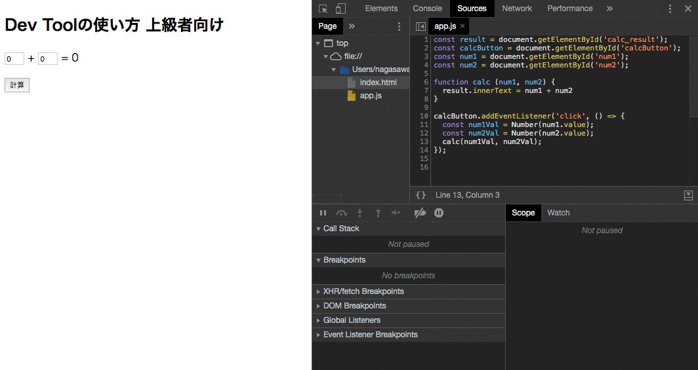

# Google Developer Tool 使い方

JavaScriptのデバッグは実装する上で必要なスキルになるため、基本的な使い方の紹介になります。  
Developer Toolを使うことで関数の動きなどの処理がどのように進んでいるか確認できます。

## ドキュメント

- [Google Developer Tool ドキュメント ](https://developers.google.com/web/tools/chrome-devtools/?utm_source=dcc&utm_medium=redirect&utm_campaign=2018Q2)

## サンプルコード

以下のサンプルHTMLとJSをダウンロードしてChromeで表示してください。

- [サンプルコード](https://github.com/js-workshop-sapporo/document/tree/master/devtool/example)

## Developer Toolの表示

- Windows : `F12`
- Mac : `command + option + I`

## コンソール画面を開いてみる

サンプルコードを表示した状態で、Developer Toolを表示してください。

### 変数をconsole.log()してみる

Developer Tool上で、変数を定義してconsole.logする方法になります。
改行をいれる場合は、 `Shift + Enter` でできます。

```js
const jsWorkshopSapporo = 'JS Workshop Sapporo 勉強会第一回目'
console.log(jsWorkshopSapporo)
// JS Workshop Sapporo 勉強会第一回目
```


### ブレークポイントについて

ブレークポイントは、プログラムの実行中に任意の行で止めることができる機能です。  
設定することで現在の変数の値の確認などができます。forやイベントに関する状態の把握が可能になります。

```js
// map新しい配列を取り出すときの変数を確認する
const array = ['ほげ', 'ぴよ', 'ふー']
array.map( value => {
  return value
})
```

1. Developer Toolを開く
2. Sourcesタブを開く
3. 該当の行をクリックしてブレークポイントを設定する 8行目
4. リロードする
5. 止まったタイミングで現在のvalueの値をScopeパネルのLocalで参照する

- <a href="https://www.dropbox.com/s/t1esjt5auyol0y4/20190523010950.mp4?dl=0" target="_blank">ブレークポイントの参考動画</a>

### 変数の確認

複雑なプログラムなどで変数の値が変化する場合など（例えばループのN番目の変数）を確認する際は、プレイクポイントと変数にマウスを当てることで確認できます。

- マウスを当てると変数を見る
- スコープ内の変数をみる

1. Developer Toolを開く
2. Sourcesタブを開く
3. 該当の行をクリックしてブレークポイントを設定する
4. 止まったタイミングで変数にマウスを当てて現在の変数を確認する
5. Scope内のLocalの値で現在の変数を確認する

- <a href="https://www.dropbox.com/s/syplngi8bnx8pfq/20190618171243.mp4?dl=0" target="_blank">変数の確認とスコープ内の変数を確認する</a>

### プログラムのステップ実行

ステップ実行のボタンを把握することでデバッグのスキルがあがります。


- リジューム実行
- ステップイン
- ステップオーバー、ステップアウト

#### リジューム実行

ブレークポイントで止まっていたプログラムのの続きを実行します。  
複数のブレークポイントを設定し想定通りの処理になっている確認できます。

#### ステップイン

ブレークポイントで止まったときは、まだその行は実行されていない状態です。  
ステップインを実行することで、現在の行のプラグラムを実行して次の処理の行へ移動してプログラムが止まります。  
プログラムが実行される処理の流れを1つずつ確認できます。

#### ステップオーバー、ステップアウト

ステップオーバーとステップアウトは大まかな処理の流れを確認するのに役立ちます。  
ステップオーバーは現在止まっている行で関数が実行されている場合に内部の処理すべて実行して次の行で止まる  
ステップアウトは現在の処理が止まっている関数内の残りの処理をすべて実行し関数を呼び出している行に移動する

ステップイン、ステップオーバー、ステップアウトうまく使い分けしながらデバッグを行います。

- <a href="https://www.dropbox.com/s/kscu3i21aookt6t/20190619022318.mp4?dl=0" target="_blank">ステップ実行の流れ動画</a>

## 上級者向けの使い方

### 条件付きブレークポイント

その名の通り、特定条件の場合のみブレークポイントを動作させます。
下記サンプル動画の場合 `num1Val === 3` の時にブレークポイントが動作します。 



### ログポイント

コンソールパネルにログを出力するための機能です。
ログを出力するだけで、コード実行は停止しません。
ファイルに直接 `console.log()` を記載しなくてもログを確認できます。


### ライブ・エクスプレッション

変数の値を監視したい場合に役立ちます。
値を監視はしたいけどコンソールパネルをログだらけにしたくない場合に役立ちます。
※250ミリ秒間隔でライブ・エクスプレッションの値が更新されます。


