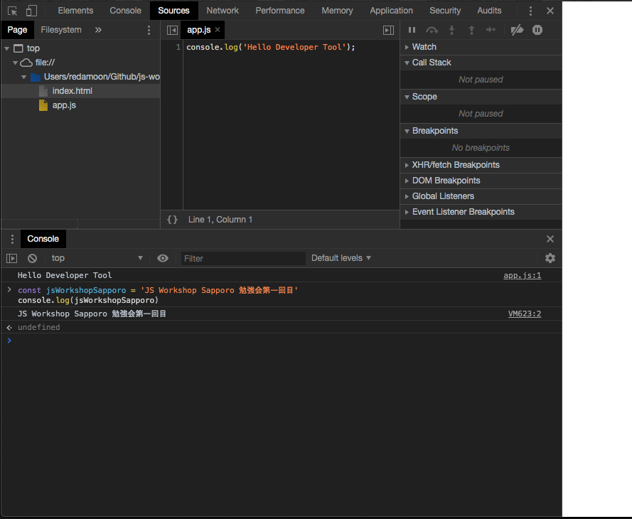

# Google Developer Tool 使い方

JavaScriptのデバッグは実装する上で必要なスキルになるため、基本的な使い方の紹介になります。

## ドキュメント

- [Google Developer Tool ドキュメント ](https://developers.google.com/web/tools/chrome-devtools/?utm_source=dcc&utm_medium=redirect&utm_campaign=2018Q2)

## サンプルコード

以下のサンプルHTMLとJSをダウンロードしてChromeで表示してください。

- [サンプルコード](https://github.com/js-workshop-sapporo/document/tree/master/devtool/example)

## Developer Toolの表示

- Windows : `F12`
- Mac : `command + option + I`

## コンソール画面を開いてみる

サンプルコードを表示した状態で、Developer Toolを表示させてください。

### 変数をconsole.log()してみる

```js
const jsWorkshopSapporo = 'JS Workshop Sapporo 勉強会第一回目'
console.log(jsWorkshopSapporo)
// JS Workshop Sapporo 勉強会第一回目
```

