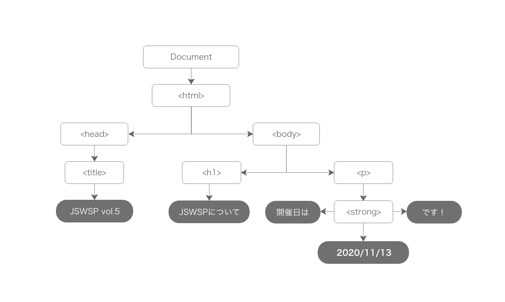

# js workshop sapporo vol5

DOM について学ぶ回です。

ローカルサーバとして `npx @js-primer/local-server` を利用して作っていきます。  
[source リポジトリ](https://github.com/js-workshop-sapporo/source) から先にベースファイルをクローンしておきます。
クローン後、ターミナルから `source` ディレクトリに移動して上記のコマンドを使うことでブラウザで `localhost:3000` で HTML を表示させることができます。  
Node.js を インストールされてない方は、インストールしておきましょう。

Node.js のインストールについては[こちら](https://github.com/js-workshop-sapporo/document/tree/master/doc/node)をご確認ください。

## DOM について

Web 制作をする上で DOM と JS は切って離せない関係といえるでしょう。  
課題に入る前に DOM とは何なのかをざっくりと知っていただくために下記を一読しておくことをおすすめします。

### DOM とは？

DOM とは `Document Object Model` の略で、Web 上の文章コンテンツを構造化したオブジェクトです。  
オブジェクトについては JavaScript の基本となる知識となりますので MDN の下記ページを確認してください。

- [JavaScript オブジェクトの基本](https://developer.mozilla.org/ja/docs/Learn/JavaScript/Objects/Basics)

DOM は Document Object Model という名前の略称で、 HTML や XML をプログラミング言語（JS など）で扱うための API となります。  
その名のとおり、文書に含まれる要素、属性をオブジェクトとみなし、文書というのはオブジェクトの集合体だと考えることができます。  
文書を構成するオブジェクトは、要素ノード、属性ノード、テキストノードなどと呼びます。  
DOM にはこれらのノードを取得、追加、置換、削除ができる API を提供しています。  
たとえば JS で DOM にアクセスして、テキストやスタイルを操作できます。

```html
<!DOCTYPE html>
<html>
  <head>
    <title>JSWSP Vol.5</title>
  </head>
  <body>
    <h1 id="title">JSWSPについて</h1>
    <p>開催日は<strong>2020/11/13</strong>です！</p>
  </body>
</html>
```

```javascript
// id="title" の要素を取得する
const title = document.getElementById("title");
// <h1 id="title">JSWSP Vol.5 Online について</h1> に更新される
title.innerText = "JSWSP Vol.5 Online について";
// console.dir()を使えばElementがどんなプロパティを持っているか階層的なリストで確認できます
console.dir(title);
```

また、DOM はドキュメントを文章ツリーとして扱います。
したがって、上記のような html の場合、次のようなツリー構造と解釈されます。



## 課題のヒント

### addEventListener

特定の要素に対してイベントを呼びだすための関数を設定できます。  
今回はクリックやドラッグで何かをする処理が必要になるため、イベントを発行させたい要素に対して設定していきます。

```js
対象要素.click("種類", 関数, false);
```

第一引数：イベントの種類を設定します。

- click
- change
- dragover
- dragleave
- dragenter
- load
- touch
- touchmove
- scroll など

第二引数：イベントを発行したときに実行する処理を記述します。  
第三引数：イベントの伝播方式の設定（true/false）します。

イベントの伝播とは、親子関係にある HTML があった際に 2 つの要素にイベントリスナを登録します。
同じイベントリスナを登録した子要素（.child）をクリクすると親のイベントも同時に発行されます。

イベントの伝播順序

1. キャプチャーフェーズ：window から指定した要素とその子要素に向けてイベントを読み取る
2. ターゲットフェーズ：イベントが発生そた要素にイベントが伝わる
3. バブリングフェーズ：イベント発生元から親要素にイベントが走る

第三引数のイベントの伝播方式はこれらの処理をコントロールできます。

- true：親から先に発行する（キャプチャーフェーズ）
- false：子から先に発行する（パプリングフェーズ）※初期値

パブリングをやめる場合や実行したイベントをキャンセルする場合

- 伝播をやめる場合：`e.stopPropagation()`
- デフォルトの挙動イベントをキャンセルする場合：`e.preventDefault()`

```html
<div class="parent">
  <div class="child"></div>
</div>
```

- [addEventListener:MDN](https://developer.mozilla.org/ja/docs/Web/API/EventTarget/addEventListener)

### document.getElementById

指定した id の値をもつ要素を Element オブジェクトとして返すメソッドになります。  
HTML のタグから指定した id を習得を処理を行いたい時に利用します。

- 指定した id が存在しない場合は、`null` を返します。

利用例しては、一度変数に格納してから参照するのが一般的です。

```html
<div class="targetId">Id</div>
```

```js
const targetId = document.getElementById("targetId");
```

- [getElementById:MDN](https://developer.mozilla.org/ja/docs/Web/API/Document/getElementById)

### document.querySelectorAll、document.querySelector

querySelector は、HTML 上の要素に設定したセレクタに一致する最初の HTML 要素を取得します。

```js
const className = document.querySelectorAll(".className");
```

querySelectorAll は、HTML 上の要素に設定したセレクタに一致するすべての HTML 要素を取得します。

```js
const classNameAll = document.querySelectorAll(".classNameAll");
```

```js
const className = document.querySelector(".className");
```

クラスはセレクタを複数持たせるため、複数のセレクタにかけたい場合などに利用します。

- [querySelectorAll:MDN](https://developer.mozilla.org/ja/docs/Web/API/Document/querySelectorAll)
- [querySelector:MDN](https://developer.mozilla.org/ja/docs/Web/API/Document/querySelector)

### classList.add、classList.remove

classList.add は、指定した要素へクラスを追加できます。  
classList.remove は、指定した要素にあるクラスを削除できます。

jQuery でよく使う `addClass` や `removeClass` に相当します。

- [classList:MDN](https://developer.mozilla.org/ja/docs/Web/API/Element/classList)

### setAttribute、getAttribute

setAttribute は、指定した要素に新しい属性を追加できます。

```html
<div id="d1">ターゲット要素</div>
```

```js
const d = document.getElementById("d1");
d.setAttribute("align", "center");
```

getAttribute は、指定した要素の属性値を返します。指定された属性が存在しない場合は、 `null` になります。

```js
const div1 = document.getElementById("div1");
const align = div1.getAttribute("align");

alert(align);
```

- [setAttribute:MDN](https://developer.mozilla.org/ja/docs/Web/API/Element/setAttribute)
- [getAttribute:MDN](https://developer.mozilla.org/ja/docs/Web/API/Element/getAttribute)

### appendChild、removeChild

appendChild は、動的に要素を追加したいときに利用します。  
removeChild は、要素を削除したときに利用します。

- [appendChild:MDN](https://developer.mozilla.org/ja/docs/Web/API/Node/appendChild)
- [removeChild:MDN](https://developer.mozilla.org/ja/docs/Web/API/Node/removeChild)

### FileReader、dataTransfer

- [FileReader:MDN](https://developer.mozilla.org/ja/docs/Web/API/FileReader)
- [dataTransfer:MDN](https://developer.mozilla.org/ja/docs/Web/API/DataTransfer)
