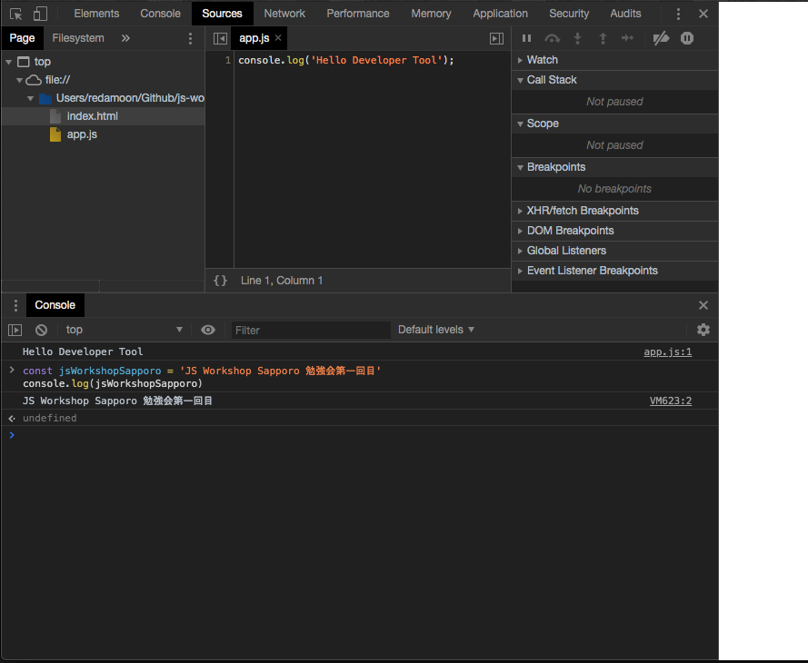
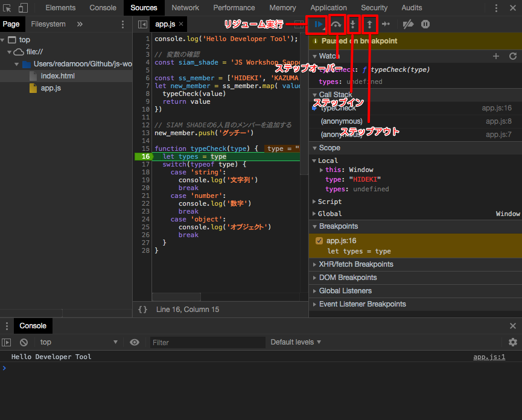
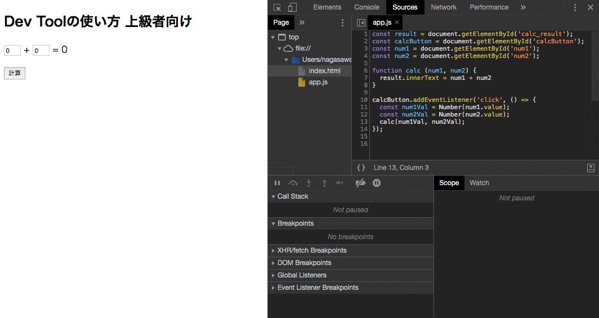
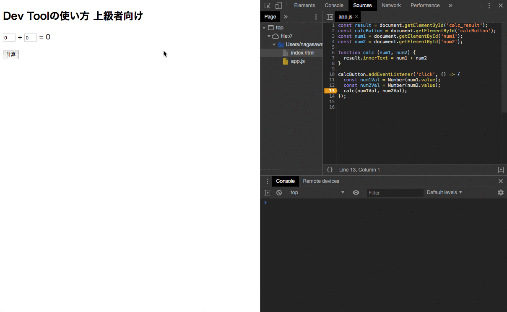
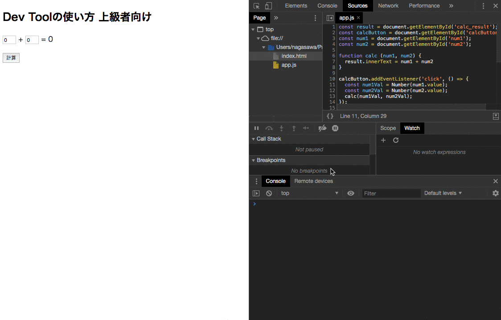

# Google Developer Tool 使い方

JavaScript のデバッグは実装する上で必要なスキルになるため、基本的な使い方の紹介になります。  
Developer Tool を使うことで関数の動きなどの処理がどのように進んでいるか確認できます。

## ドキュメント

- [Google Developer Tool ドキュメント ](https://developers.google.com/web/tools/chrome-devtools/?utm_source=dcc&utm_medium=redirect&utm_campaign=2018Q2)

## サンプルコード

次のサンプル HTML と JS をダウンロードして Chrome で表示してください。

- [サンプルコード](https://github.com/js-workshop-sapporo/document/tree/master/devtool/example)

## Developer Tool の表示

- Windows : `F12`
- Mac : `command + option + I`

## 基本的なデバッグの流れ

1. コード全体を把握する（関数単位でのチェック）
2. Sources パネルを開き、関数ごとにブレークポイントを設定して処理の動きを確認する
3. Network パネルで API などの取得ができているかなどを確認する
4. コードの行単位で変数の中身や引数の型などを確認する
5. 2〜4 を繰り返し問題になっているコードの修正を行う

## コンソール画面を開いてみる

サンプルコードを表示した状態で、Developer Tool を表示してください。

### 変数を console.log()してみる

Developer Tool 上で、変数を定義して console.log する方法になります。
改行をいれる場合は、 `Shift + Enter` でできます。

```js
const jsWorkshopSapporo = "JS Workshop Sapporo 勉強会第一回目";
console.log(jsWorkshopSapporo);
// JS Workshop Sapporo 勉強会第一回目
```



### ブレークポイントについて

ブレークポイントは、プログラムの実行中に任意の行でやめることができる機能です。  
設定することで現在の変数の値の確認などができます。for やイベントに関する状態の把握が可能になります。

```js
// map新しい配列を取り出すときの変数を確認する
const array = ["ほげ", "ぴよ", "ふー"];
array.map(value => {
  return value;
});
```

1. Developer Tool を開く
2. Sources タブを開く
3. 該当の行をクリックしてブレークポイントを設定する 8 行目
4. リロードする
5. 止まったタイミングで現在の value の値を Scope パネルの Local で参照する

- <a href="https://www.dropbox.com/s/t1esjt5auyol0y4/20190523010950.mp4?dl=0" target="_blank">ブレークポイントの参考動画</a>

### 変数の確認

複雑なプログラムなどで変数の値が変化する場合など（たとえばループの N 番目の変数）を確認する際は、プレイクポイントと変数にマウスを当てることで確認できます。

- マウスを当てると変数を見る
- スコープ内の変数をみる

1. Developer Tool を開く
2. Sources タブを開く
3. 該当の行をクリックしてブレークポイントを設定する
4. 止まったタイミングで変数にマウスを当てて現在の変数を確認する
5. Scope 内の Local の値で現在の変数を確認する

- <a href="https://www.dropbox.com/s/syplngi8bnx8pfq/20190618171243.mp4?dl=0" target="_blank">変数の確認とスコープ内の変数を確認する</a>

### プログラムのステップ実行

ステップ実行のボタンを把握することでデバッグのスキルがあがります。



- レジューム実行
- ステップイン
- ステップオーバー、ステップアウト

#### レジューム実行

ブレークポイントで止まっていたプログラムの続きを実行します。  
複数のブレークポイントを設定し想定とおりの処理になっている確認できます。

#### ステップイン

ブレークポイントで止まったときは、まだその行は実行されていない状態です。  
ステップインを実行することで、現在の行のプラグラムを実行して次の処理の行へ移動してプログラムが止まります。  
プログラムが実行される処理の流れを 1 つずつ確認できます。

#### ステップオーバー、ステップアウト

ステップオーバーとステップアウトは大まかな処理の流れを確認するのに役立ちます。  
ステップオーバーは現在止まっている行で関数が実行されている場合に内部の処理すべて実行して次の行で止まる  
ステップアウトは現在の処理が止まっている関数内の残りの処理をすべて実行し関数を呼び出している行に移動する

ステップイン、ステップオーバー、ステップアウトうまく使い分けしながらデバッグを行います。

- <a href="https://www.dropbox.com/s/kscu3i21aookt6t/20190619022318.mp4?dl=0" target="_blank">ステップ実行の流れ動画</a>

## 上級者向けの使い方

### 条件付きブレークポイント

その名のとおり、特定条件の場合のみブレークポイントを動作させます。  
下記サンプル動画の場合 `num1Val === 3` のときにブレークポイントが動作します。



### ログポイント

コンソールパネルにログを出力するための機能です。  
ログを出力するだけで、コード実行は停止しません。  
ファイルに直接 `console.log()` を記載しなくてもログを確認できます。



### ライブ・エクスプレッション

変数の値を監視したい場合に役立ちます。  
値を監視はしたいけどコンソールパネルをログだらけにしたくない場合に役立ちます。  
※250 ミリ秒間隔でライブ・エクスプレッションの値が更新されます。


